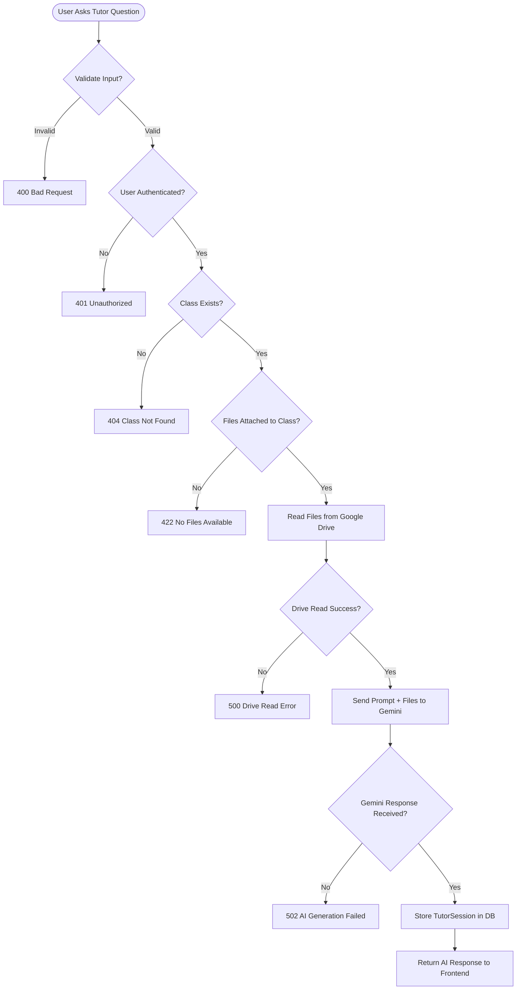

```mermaid
flowchart TD
A([User Asks Tutor Question]) --> B{Validate Input?}
B -- Invalid --> E[400 Bad Request]
B -- Valid --> C{User Authenticated?}
C -- No --> F[401 Unauthorized]
C -- Yes --> D{Class Exists?}
D -- No --> G[404 Class Not Found]
D -- Yes --> H{Files Attached to Class?}
H -- No --> I[422 No Files Available]
H -- Yes --> J[Read Files from Google Drive]
J --> K{Drive Read Success?}
K -- No --> L[500 Drive Read Error]
K -- Yes --> M[Send Prompt + Files to Gemini]
M --> N{Gemini Response Received?}
N -- No --> O[502 AI Generation Failed]
N -- Yes --> P[Store TutorSession in DB]
P --> Q[Return AI Response to Frontend]
```
